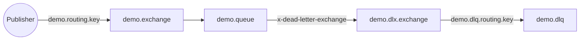
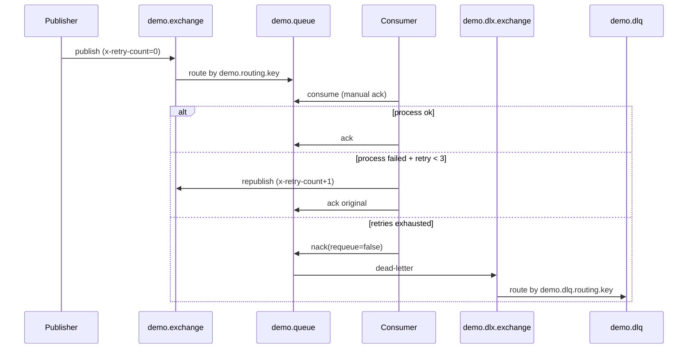

# RabbitMQ DLQ Console Demo

Tài liệu này chỉ mô tả console `DLQ/RabbitMqPractices.DLQ` (project `RabbitMqPractices.DLQ.csproj`).

## Mục tiêu

- Thiết lập exchange/queue/binding cho main queue và DLQ.
- Luồng publish -> consume -> retry -> DLQ.
- Cách đọc `x-death` từ DLQ.

## Topology (Exchange/Queue/Binding)

Được khai báo tại `DLQ/RabbitMqPractices.DLQ/Infrastructure/QueueTopology.cs` với hằng số ở `DLQ/RabbitMqPractices.DLQ/Config/RabbitMQConstants.cs`.

- Exchanges:
  - Main: `demo.exchange` (direct)
  - DLX: `demo.dlx.exchange` (direct)
- Queues:
  - Main: `demo.queue`
  - DLQ: `demo.dlq`
- Bindings:
  - `demo.exchange` + `demo.routing.key` -> `demo.queue`
  - `demo.dlx.exchange` + `demo.dlq.routing.key` -> `demo.dlq`
- Queue arguments trên `demo.queue`:
  - `x-dead-letter-exchange = demo.dlx.exchange`
  - `x-dead-letter-routing-key = demo.dlq.routing.key`
  - `x-message-ttl = 30000` (tuỳ chọn; message hết TTL sẽ vào DLQ)

Mermaid sơ đồ topology:



## Flow Publish

Defined in `DLQ/RabbitMqPractices.DLQ/Services/MessagePublisher.cs`:

- Serialize `OrderMessage` thành JSON.
- Set headers/properties:
  - `content-type=application/json`
  - `message-id=OrderId`
  - `x-retry-count=0`
- Publish vào `demo.exchange` với routing key `demo.routing.key`.
- Publisher dùng confirm channel (timeout ngắn).

## Flow Consume + Retry + DLQ

Defined in `DLQ/RabbitMqPractices.DLQ/Services/MessageConsumer.cs`:

- `prefetch=1`, `autoAck=false`.
- ACK chỉ sau khi xử lý thành công.
- Khi lỗi:
  - Đọc `x-retry-count` từ headers.
  - Nếu `< MaxRetryCount (3)`: re-publish message vào main exchange và tăng `x-retry-count`, sau đó ACK bản cũ.
  - Nếu vượt retry: `BasicNack(requeue: false)` để message bị dead-letter sang DLQ.

Mermaid sequence diagram:



## DLQ Consumer Flow

Defined in `DLQ/RabbitMqPractices.DLQ/Services/DlqConsumer.cs`:

- Consume từ `demo.dlq` với manual ack.
- Đọc `x-death` để lấy reason, queue gốc, số lần chết.
- Log thông tin và ACK message.

## Console Menu

Defined in `DLQ/RabbitMqPractices.DLQ/Program.cs`:

- `1`: publish message bình thường.
- `2`: publish message lỗi (`SimulateError=true`) -> retry -> DLQ.
- `3`: batch publish (mixed).
- `4`: start main consumer.
- `5`: start DLQ consumer.

## Cấu hình

`DLQ/RabbitMqPractices.DLQ/appsettings.json`:

```text
HostName=127.0.0.1
Port=5672
StreamPort=5552
UserName=guest
Password=guest
VirtualHost=/
Ssl=false
```

Ghi chú:

- Demo DLQ dùng AMQP port `5672`.
- Credentials có thể khác tuỳ Docker/instance của bạn.
